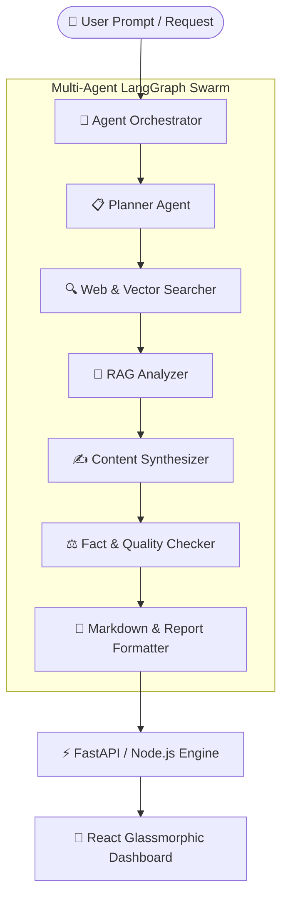

<div align="center">

  <!-- Phase 1: Animated Glassmorphism Bento Terminal Banner -->
  <picture>
    <source media="(prefers-color-scheme: dark)" srcset="https://raw.githubusercontent.com/mayankcharde/mayankcharde/main/dark.svg">
    <source media="(prefers-color-scheme: light)" srcset="https://raw.githubusercontent.com/mayankcharde/mayankcharde/main/light.svg">
    
  </picture>

  <br/><br/>

  <!-- Dynamic Typing Subtitle Animation -->
  <a href="https://git.io/typing-svg">
    
  </a>

  <br/><br/>

  <!-- Phase 4: Social Badges (For-the-badge with exact palette styling) -->
  <a href="https://www.linkedin.com/in/mayank-charde-56636b2a4/">
    
  </a>
  &nbsp;&nbsp;
  <a href="https://personal-portfolio-delta-inky-35.vercel.app/">
    
  </a>
  &nbsp;&nbsp;
  <a href="mailto:mayankcharde2@gmail.com">
    
  </a>
  &nbsp;&nbsp;
  <a href="https://twitter.com/mayankcharde">
    
  </a>

</div>

<br/>

---

### ⚡ SYSTEM METRICS & KERNEL STATUS

```gdb
================================================================================--------------------
[MAVERICK_OS :: OPERATIONAL_READOUT]
----------------------------------------------------------------------------------------------------
• SUBJECT       : Mayank Charde (Callsign: MAVERICK)
• ROLE          : AI & Full-Stack Developer | Multi-Agent Systems Architect
• INSTITUTION   : St. Vincent Pallotti College of Engineering & Technology (B.Tech AI, CGPA: 8.6)
• LOCATION      : Nagpur, Maharashtra, India
• CURRENT FOCUS : Autonomous LangGraph Workflows, RAG Vector Search, Scalable MERN & FastAPI
• AVAILABILITY  : 🚀 Open for Software Engineering, Full-Stack & Generative AI Roles
================================================================================--------------------
```

---

### 🧠 MULTI-AGENT & FULL-STACK ENGINE

> [!NOTE]  
> **Engineering Focus**: Specializing in orchestrating complex autonomous AI multi-agent workflows using **LangGraph**, **LangChain**, and **Mistral AI / Gemini APIs**. I bridge deep generative AI pipelines with production-grade **MERN & FastAPI** web applications.



---

### 🛠 TECH STACK & ECOSYSTEM MATRIX

<div align="center">

| Domain | Core Stack & Frameworks |
| :--- | :--- |
| **Generative & Agentic AI** | `LangGraph` `LangChain` `Gemini API` `Mistral AI` `RAG` `MCP` `ChromaDB` `PyTorch` `TensorFlow` |
| **Frontend Engineering** | `React.js` `JavaScript (ES6+)` `TypeScript` `Tailwind CSS` `Framer Motion` `HTML5/CSS3` |
| **Backend & APIs** | `Node.js` `Express.js` `FastAPI` `Python` `MongoDB` `MySQL` `REST APIs` `JWT Auth` |
| **Tools & Infrastructure** | `Git` `GitHub` `Docker` `Postman` `Puppeteer` `Socket.IO` `Vercel` `Render` `Razorpay` |

<br/>

[](https://skillicons.dev)

</div>

---

### 🚀 FEATURED FLAGSHIP PROJECTS

<br/>

#### 1. 🔮 [Literai – Multi-Agent AI Research Assistant](https://github.com/mayankcharde/literai)
> **Production-Ready Multi-Agent Autonomous Research Platform**  
> Orchestrates **9 specialized AI agents** (Orchestrator, Planner, Searcher, Analyzer, Writer, Fact Checker, Reviewer, Summarizer, Formatter) using **LangGraph, LangChain, and Mistral AI**. Performs deep research, RAG vector Q&A with ChromaDB, automated quality scoring, and report exports.  
> 🟢 **Status**: `LIVE` &nbsp;|&nbsp; 🔗 **Live App**: [literai-neon.vercel.app](https://literai-neon.vercel.app/)  
> 💻 **Tech**: `LangGraph` `LangChain` `FastAPI` `React` `MongoDB` `ChromaDB` `Mistral AI`

#### 2. 📑 [IntelliBlog – Multi-Agent AI Blog Writing System](https://github.com/mayankcharde/Blog-Writing)
> **Autonomous Content Generation & SEO Pipeline**  
> Employs autonomous AI agents for topic analysis, content structuring, SEO keyword optimization, and article polishing using **LangGraph** agentic workflows.  
> 🟢 **Status**: `LIVE` &nbsp;|&nbsp; 🔗 **Live App**: [blog-writing-xdnf.vercel.app](https://blog-writing-xdnf.vercel.app/)  
> 💻 **Tech**: `LangGraph` `Mistral AI` `Node.js` `React` `Express` `REST APIs`

#### 3. 🎓 [NADT Taxpayer Education Platform](https://github.com/mayankcharde/nadt4)
> **Secure E-Learning & Automated Certification Platform**  
> Built for the National Academy of Direct Taxes (NADT). Includes video learning modules, progress tracking, and automated PDF certificate generation/mailing via **Puppeteer & SendGrid**.  
> 🟢 **Status**: `LIVE` &nbsp;|&nbsp; 🔗 **Live App**: [nadt4.vercel.app](https://nadt4.vercel.app/)  
> 💻 **Tech**: `React` `Node.js` `MongoDB` `Razorpay` `Puppeteer` `SendGrid`

#### 4. 🔍 [FoundIt – QR-Enabled Lost & Found Platform](https://github.com/mayankcharde/FoundIt)
> **Privacy-Preserving Contact & Real-Time Messaging**  
> Enables item owners to attach unique QR codes to belongings. Finders scan to establish instant, real-time anonymous chat channels via **Socket.IO** without exposing personal phone numbers.  
> 🚧 **Status**: `IN PROGRESS` &nbsp;|&nbsp; 🔗 **Live App**: [found-it-jet.vercel.app](https://found-it-jet.vercel.app/)  
> 💻 **Tech**: `MERN Stack` `Socket.IO` `QR Engine` `MongoDB` `Express`

#### 5. 🤖 [DeepSeek AI Clone](https://github.com/mayankcharde/FINAL-DEEPSEEK2)
> **Multimodal AI Interface with Speech & Image Generation**  
> Features real-time voice speech-to-text input, dynamic AI response streaming, custom image generation, and Razorpay tier subscription processing.  
> 🟢 **Status**: `LIVE` &nbsp;|&nbsp; 🔗 **Live App**: [final-deepseek-2.vercel.app](https://final-deepseek-2.vercel.app/)  
> 💻 **Tech**: `MERN Stack` `Gemini API` `Razorpay` `Speech APIs`

---

### 💼 EXPERIENCE & CAREER TIMELINE

```yaml
- Work Experience:
    - Role: AI Intern
      Company: Infosys Springboard
      Duration: Nov 2025 - Present | Virtual
      Achievements:
        - Built an AI Car Lease & Loan Contract Negotiation Assistant.
        - Implemented Tesseract OCR document parsing pipeline.
        - Developed LangChain NLP pipelines for financial clause extraction & risk evaluation.

    - Role: MERN Stack Developer Intern
      Company: Codec Technologies India
      Duration: Jun 2025 - Present | Hybrid
      Achievements:
        - Developing full-stack production applications using the MERN stack.
        - Optimized database query pipelines to reduce API latency.

- Education:
    - Degree: B.Tech in Artificial Intelligence
      College: St. Vincent Pallotti College of Engineering & Technology, Nagpur
      Duration: 2023 - 2027 | CGPA: 8.6
```

---

### 🏆 ACHIEVEMENTS & CERTIFICATIONS

<div align="center">

| Achievement / Award | Issuer / Organization | Recognition |
| :--- | :--- | :--- |
| 🚀 **SWALAMBH 2026 Top 15** | SVPCET Nagpur x GCVI/HCL | Top 15 team for AI-driven real-world solution |
| 🌟 **Webathon 2.0 National Finalist** | Webathon 2.0 Mumbai | Ranked Top 20 nationally out of 125+ teams |
| 🎵 **Beatbots Runner-Up (3rd)** | AI Music Gen Challenge | 3rd place globally for classical-rock AI fusion generation |

<br/>


&nbsp;&nbsp;

&nbsp;&nbsp;

&nbsp;&nbsp;


</div>

---

### 📊 PHASE 2 & 3: STATS & CONTRIBUTION SNAKE ANIMATION

<div align="center">

  <!-- Phase 3: Theme-Aware Contribution Snake Animation -->
  <picture>
    <source media="(prefers-color-scheme: dark)" srcset="https://raw.githubusercontent.com/mayankcharde/mayankcharde/output/github-snake-dark.svg" />
    <source media="(prefers-color-scheme: light)" srcset="https://raw.githubusercontent.com/mayankcharde/mayankcharde/output/github-snake.svg" />
    
  </picture>

  <br/><br/>

  <!-- Phase 2: Self-Hosted GitHub Streak & Stats Cards -->
  

  <br/><br/>

  
  &nbsp;
  

</div>

---

<div align="center">

  ### 📬 CONNECT & COLLABORATE

  [](https://personal-portfolio-delta-inky-35.vercel.app/)
  [](https://www.linkedin.com/in/mayank-charde-56636b2a4/)
  [](mailto:mayankcharde2@gmail.com)
  [](https://twitter.com/mayankcharde)

  <br/>

  <sub>Designed with 💜 by Mayank Charde | Powered by MAVERICK_OS Multi-Agent Architecture</sub>

</div>
